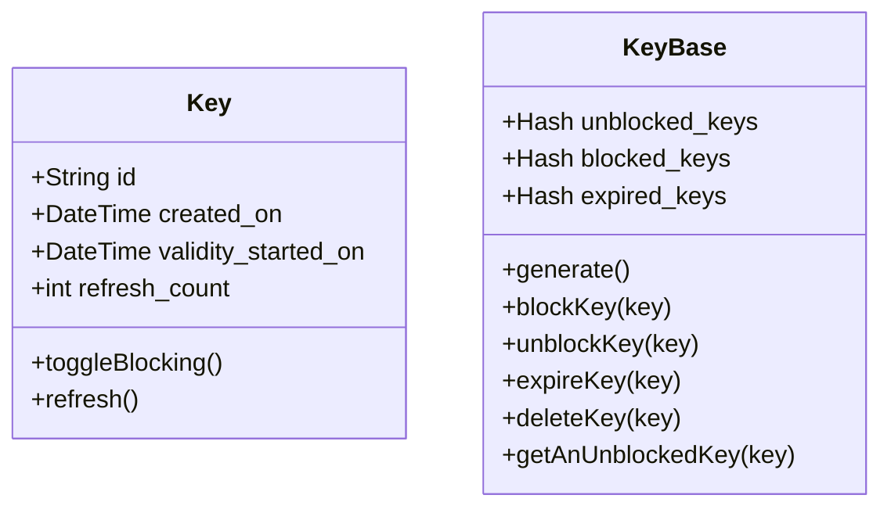

# KEY SERVER RB

This is a onboarding project. The problem statement of the project can be found at [problem_statement.txt](https://github.com/tushar2289/key-server-rb/blob/master/problem_statement.txt)

## Steps for installation

1. Install **rvm**
   [`https://rvm.io/rvm/install#basic-install`](https://rvm.io/rvm/install#basic-install)
   Choose the option - _Install RVM stable with ruby_

2. Install **Sinatra**
   [`https://github.com/sinatra/sinatra`](https://github.com/sinatra/sinatra)

3. Running the webserver

   ```
   ruby myapp.rb
   ```

4. Opening homepage
   [`http://localhost:4567/`](http://localhost:4567/)
   Open above link on browser

## API logic

1. `/generate-key`
   This API will generate the key and set the `created_on` time to be now. The same key is then added to `unblocked_keys`

2. `/get-available-key`
   This API will get the first key from the list of `unblocked_keys`. The key will be blocked and will be moved from the `unblocked_keys` list to `blocked_keys` list.

3. `/unblock-key/:key`
   This API will unblock the key sent in the `:key` parameter and if not found will return 404.

4. `/delete-key`
   This API will unblock the key sent in the `:key` parameter and if not found will return 404.

## Classes

To be viewed using (Mermaid)[https://mermaid-js.github.io/mermaid-live-editor/]



### Key

This class contains the details of every single Key generated.

### KeyBase

This class manages all the keys and has the list of blocked, unblocked and expired keys

## Commit rules

Follow [gitmoji](https://github.com/carloscuesta/gitmoji) style and rules
