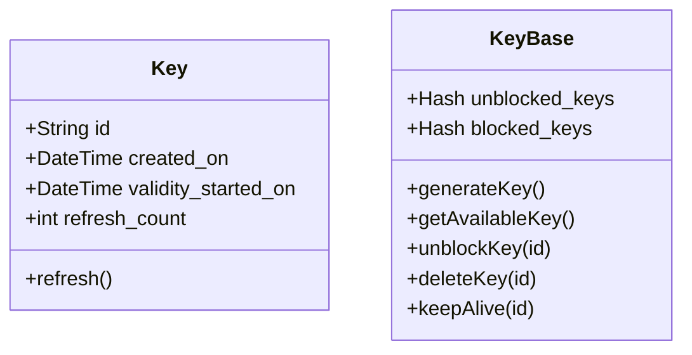

## Classes

To be viewed using [Mermaid](https://mermaid-js.github.io/mermaid-live-editor/)

To view this better in github.com install [Mermaid diagrams](https://chrome.google.com/webstore/detail/mermaid-diagrams/phfcghedmopjadpojhmmaffjmfiakfil?hl=en) extension

### Key

This class contains the details of every single Key generated.

### KeyBase

This class manages all the keys and has the list of blocked and unblocked keys
